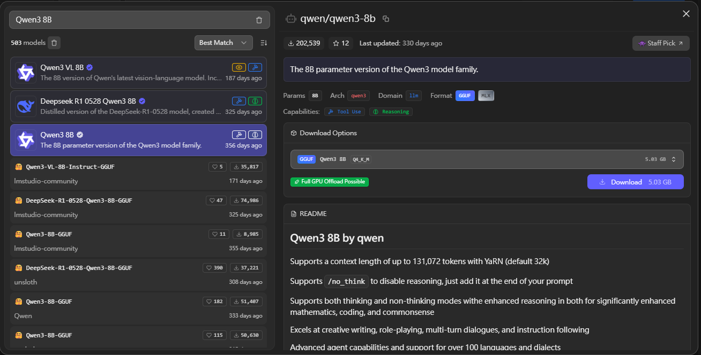
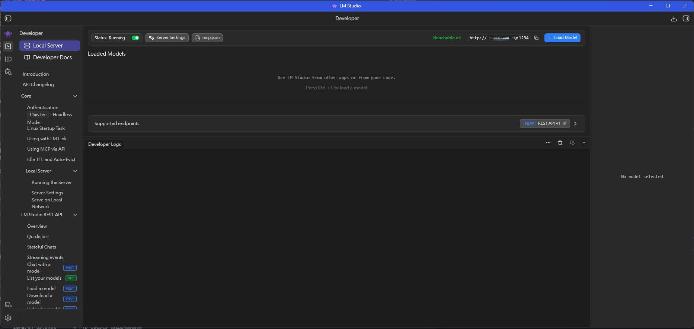
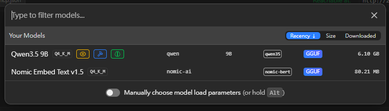
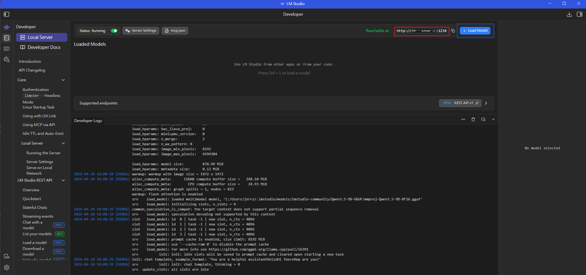
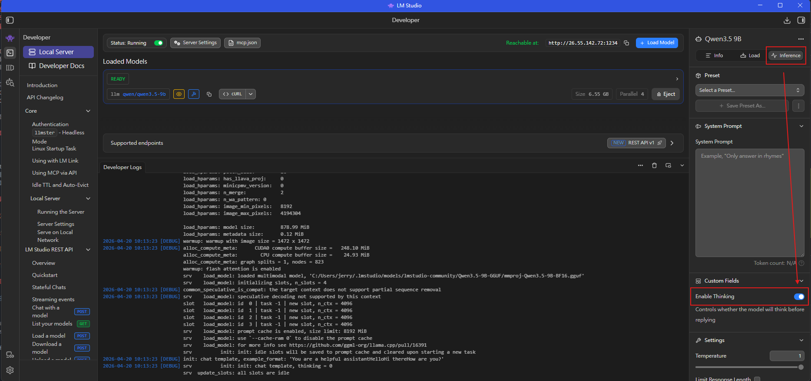

# Minecraft MOD 翻譯工具

一個用本地 AI 模型或 Google Translate 來翻譯 Minecraft 模組的 Python 工具。
輸入 mods 資料夾，輸出可直接載入遊戲的資源包。

## 功能特色

- **多種翻譯來源**
  - 本地 LLM（LM Studio / Ollama，透過 OpenAI 相容 API）
  - Google Translate（免費、不需 API Key）
- **支援多種翻譯格式**
  - JAR 模組的 `assets/*/lang/en_us.json`
  - 遊戲目錄下散落的語言檔（`config/*/lang/`、`kubejs/assets/*/lang/` 等）
  - FTB Quests 的 `en_us.snbt` 語言檔
  - FTB Quests 任務檔中嵌入的文字（`chapters/*.snbt` 中的 `title`、`description` 等）
- **智慧增量翻譯**
  - 逐鍵比對：只翻譯新增或缺失的字串
  - 讀取 resourcepacks 資料夾既有翻譯
  - SQLite 快取避免重複翻譯
  - 合併模式：新翻譯與舊翻譯合併，不覆蓋
- **格式碼保護**
  - 自動遮罩 `<T1>`、`$(l)`、`${var}` 等佔位符
  - `&r`、`§l`、`<imp>` 等 passthrough 格式碼
  - 翻譯後自動修復遺失的色碼
- **效能優化**
  - 並行批次處理（多個 API 請求同時進行）
  - 依 context 長度動態調整批次大小
  - GPU VRAM 偵測自動建議設定
- **自動偵測**
  - Minecraft 版本（從 `mmc-pack.json` / `version.json` / mod JAR）
  - 對應的 `pack_format`
  - 遊戲的 `resourcepacks/` 資料夾作為預設輸出位置

## 系統需求

- **Python 3.10+**
- **Windows** / macOS / Linux
- **本地 LLM**：[LM Studio](https://lmstudio.ai/) 或 [Ollama](https://ollama.com/)（建議 8GB+ VRAM）
  - 推薦模型：Qwen3 8B / 14B（中文能力優秀）
- **或** Google Translate（免費、無需 GPU）

## 安裝

### 🟢 方式 A：直接下載 .exe（推薦一般使用者）

**不需要安裝 Python 或任何依賴，下載一個檔案雙擊就能用。**

1. 前往 [Releases 頁面](https://github.com/Hsiung-Shao/minecraftTranslate/releases/latest)
2. 下載 `MinecraftTranslate.exe`（約 24 MB）
3. 雙擊執行即可

> 💡 Windows 首次執行可能跳出 SmartScreen 警示（因 exe 未簽章），點「**其他資訊** → **仍要執行**」即可。

跳到下方 [**快速開始**](#快速開始) 章節。

### 🛠️ 方式 B：從原始碼執行（開發者/自行修改）

```bash
# 1. 下載專案
git clone https://github.com/Hsiung-Shao/minecraftTranslate.git
cd minecraftTranslate

# 2. 建立虛擬環境（建議）
python -m venv .venv
.venv\Scripts\activate       # Windows
source .venv/bin/activate     # macOS/Linux

# 3. 安裝依賴
pip install -r requirements.txt
```

只需要兩個套件：`customtkinter` + `requests`，其他都用 Python 標準庫。

## 快速開始

**方式 A（.exe）**：雙擊 `MinecraftTranslate.exe`

**方式 B（原始碼）**：
```bash
python main.py
```

啟動後 GUI 右邊是主控台，左邊是設定面板。

### 使用步驟

1. **選擇 API 服務商**
   - **LM Studio (本機)** → 打開 LM Studio，載入模型，啟動本機伺服器
   - **Google Translate (免費)** → 不需設定任何東西
   - **自訂** → 填入你自己的 OpenAI 相容 API URL

2. **測試連線**
   - 點「測試連線」確認模型有載入

3. **選擇 mods 資料夾**
   - 點 `...` 選擇 Minecraft 實例的 `mods` 資料夾
   - 工具會自動偵測同一實例的 `resourcepacks/` 作為預設輸出
   - PrismLauncher / MultiMC / 原生啟動器都支援

4. **選擇目標語言**
   - 預設繁體中文 `zh_tw`
   - 支援 13 種語言

5. **偵測 VRAM（選擇性）**
   - 點「偵測 VRAM 自動設定」→ 自動填入合適的 context 長度、批次大小、並行工作數

6. **執行翻譯**
   - **「分析」**：先掃描看有哪些模組需要翻譯（不實際翻譯）
   - **「翻譯全部」**：掃描並翻譯所有待翻譯內容
   - **「選擇模組」**：分析後挑選特定模組翻譯

7. **完成**
   - 資源包自動輸出到 `resourcepacks/ModTranslation_zh_tw.zip`
   - 進遊戲啟用即可

## 進階設定

### 批次大小與 Context 長度

- `Context 長度` 越大，每批可塞更多字串
- 預設 8192 tokens
- 如果使用大 context 模型（如 qwen3 有 32K+），可手動調到 16384 或 32768

### VRAM 建議表

| VRAM | context | batch_size | workers |
|------|---------|------------|---------|
| < 6 GB | 4096 | 8 | 1 |
| 6-12 GB | 8192 | 15 | 2 |
| 12-24 GB | 16384 | 20 | 2 |
| > 24 GB | 32768 | 30 | 3 |

### 實測效能參考

以下為實際測試的耗時數據，供硬體選擇與時間預估參考：

**測試硬體**
- CPU：AMD Ryzen 7 9800X3D
- GPU：NVIDIA RTX 5070 (12 GB VRAM)
- RAM：64 GB
- 模型：Qwen3 8B (Q4_K_M)，**Enable Thinking 關閉**

**實測結果**

| 整合包 | 模組數 | 字串數 | 耗時 |
|--------|-------|--------|------|
| Craft to Exile 2 (VR Support) | ~250 | ~33,000 | 約 1.5 小時 |
| All the Mons - ATMons | ~240 | ~40,000 | 約 1.5 小時 |

> ⚡ **速度關鍵**：關閉 Enable Thinking 是提升速度的最重要因素（可加快 2-3 倍）。
> 其次是 context 長度與 batch size — 設越大，API 呼叫次數越少。

### LM Studio 完整設定教學

LM Studio 是免費的本地 LLM 執行工具，可在自己電腦上跑大型語言模型，不需要任何 API Key，資料完全不上傳。

#### 步驟 1：安裝 LM Studio

1. 下載：[https://lmstudio.ai/](https://lmstudio.ai/)（Windows / macOS / Linux）
2. 安裝後第一次開啟會引導你建立 models 資料夾

#### 步驟 2：下載模型

開啟 LM Studio，點左側 🔍 **Discover**（放大鏡圖示）進入模型搜尋頁。搜尋框輸入 `Qwen3 8B`（或其他想要的模型），右側會列出可下載的版本。



**推薦模型**（全部可在 LM Studio Discover 搜尋到）：

#### ≤ 8 GB VRAM（入門）

| 模型 | 量化 | 大小 | 說明 |
|------|------|------|------|
| **Qwen3 4B** | Q5_K_M | ≈ 3 GB | 輕量中文翻譯，速度最快 |
| **Qwen3 8B** | Q4_K_M | ≈ 5 GB | 平衡點，品質明顯提升 |
| **Llama 3.1 8B Instruct** | Q4_K_M | ≈ 5 GB | 通用好用，中文稍弱於 Qwen |
| **GLM-4 9B Chat** | Q4_K_M | ≈ 5.5 GB | 清華智譜，中文表現佳 |

#### 12 GB VRAM（甜蜜點，你的 RTX 5070 / 4070 Ti / 3060 12G 適用）

| 模型 | 量化 | 大小 | 說明 |
|------|------|------|------|
| **Qwen3 8B** | Q6_K / Q8_0 | 6.6 / 8.5 GB | 跑高量化版本，品質最好 |
| **Qwen3 14B** | Q4_K_M | ≈ 8.5 GB | **推薦首選**，翻譯品質優秀 |
| **Qwen3 14B** | Q5_K_M | ≈ 10 GB | 品質再上一層（留點緩衝給 context） |
| **Gemma 2 9B** | Q5_K_M | ≈ 6.5 GB | Google 出品，多語言能力強 |
| **Mistral Nemo 12B** | Q4_K_M | ≈ 7 GB | 快速且 context 128K |
| **GLM-4 9B Chat** | Q6_K | ≈ 8 GB | 中文流暢度高 |

> 💡 **綜合推薦**：12 GB VRAM 選 **Qwen3 14B Q4_K_M** 最佳 — 中文翻譯品質最好，剩餘 VRAM 還能支援長 context。

**下載步驟：**
1. 左側列表找到想要的模型（例如 **Qwen3 14B**，不是 VL / Coder 版本）
2. 右側面板確認版本資訊（Params、Arch、Format 應為 `GGUF`）
3. **Download Options** 區選擇量化等級
4. 若看到 🟢 **Full GPU Offload Possible**，代表你的 VRAM 能完整載入
5. 點 **Download** 開始下載（視網速需數分鐘）

> **量化選擇原則**：Q4_K_M 是速度/品質甜蜜點；Q5_K_M 品質更好但慢一些；Q3 以下品質下降明顯。同樣 VRAM 下，**大模型低量化 > 小模型高量化**（例：14B Q4 > 8B Q6）。

#### 步驟 3：開啟開發者伺服器

點左側 **Developer**（`</>` 圖示）進入開發者模式。第一次進入時看到空白畫面：



1. 上方「**Status**」開關切到 **Running**（應顯示綠色）
2. 右上角 **Reachable at** 會顯示伺服器位址（通常為 `http://localhost:1234`）
3. 埠號預設 `1234`（若被佔用可在 **Server Settings** 修改）

#### 步驟 4：載入模型

在 Developer 頁面右上角點 **+ Load Model** 開啟模型選擇對話框：



1. 列表會顯示所有已下載的模型
2. 選擇你要用的模型（例如 **Qwen3.5 9B** 或 **Qwen3 8B**）
3. 若要調整進階參數，可勾選下方「**Manually choose model load parameters**」
4. 點擊模型開始載入

載入過程中會看到詳細的 log：



觀察 Developer Logs 區域：
- `load_tensors: CPU_Mapped / CUDA0 model buffer size` — 顯示模型分配到哪些裝置
- 若看到 `CUDA0` 代表模型成功載入 GPU
- 等所有 tensor 載入完畢後，右下角會顯示 **"loaded in X.XX seconds"**

#### 步驟 5：確認模型就緒

載入完成後右側面板會出現模型控制面板：



**建議設定**（右側面板）：

- **Context Length**：建議 `8192` 以上；大 VRAM 可設 `16384` / `32768`
- **Enable Thinking**：**強烈建議關閉** ⚡
  - Thinking 模式會先輸出一大段 reasoning 才給答案，翻譯速度會變慢 2-3 倍
  - 關閉後模型直接輸出翻譯，省時且 token 用量降低
  - 翻譯品質幾乎無差別（翻譯不需要深度推理）
- **System Prompt**：翻譯工具會自行傳入，此處留空即可
- **Custom Fields**：預設即可

伺服器就緒後 Developer 頁面會顯示：
```
Status: Running  ✅
Reachable at: http://localhost:1234
Loaded Models: Qwen3-8B (qwen3)
```

**保持 LM Studio 視窗開啟**，繼續下一步。

#### 步驟 6：在翻譯工具中設定

1. 執行 `python main.py` 或雙擊 `MinecraftTranslate.exe`
2. 切換到「**連線**」分頁
3. 服務商下拉選單選 **LM Studio (本機)**
4. 確認 URL 是 `http://localhost:1234/v1`
5. 點 **🔌 測試連線**，應該看到：
   ```
   正在測試 API 連線...
   ● 已連線 (N 個模型)
   連線成功！可用模型: qwen3-8b
   當前已載入模型: qwen3-8b
   ```
6. 若看到「警告: 目前沒有載入模型」，回 LM Studio 檢查步驟 4 是否成功

#### 跨電腦使用（選擇性）

如果 LM Studio 不在本機，而是跑在區網另一台電腦上：

1. LM Studio Developer → Settings → 勾選 **Serve on Local Network**
2. 在伺服器電腦記下 IP（例如 `192.168.1.100`）
3. 翻譯工具 URL 改為 `http://192.168.1.100:1234/v1`

#### 常見問題

**模型載不起來** → VRAM 不足，換更小的模型或更高量化（Q3、Q4）

**回應很慢** → 檢查「GPU Offload」是否拉到最高；若 CPU 跑模型會非常慢

**批次翻譯超時** → 把 GUI 的 Context 長度改小，或批次大小調到 10

**模型會亂輸出思考過程** → Developer 頁面找「System Prompt」或「Template」確認沒有額外的 thinking prompt，或改用非 thinking 版本的模型

### 翻譯目錄結構

工具會掃描以下路徑：

```
<minecraft/>
├── mods/                        # JAR 模組
│   └── *.jar
├── config/                      # 設定檔中的語言
│   ├── flan/lang/en_us.json
│   └── ftbquests/quests/
│       ├── chapters/*.snbt      # FTB Quests 嵌入式文字
│       └── lang/en_us.snbt      # FTB Quests 匯出的語言檔
├── kubejs/
│   └── assets/*/lang/en_us.json
├── patchouli_books/
│   └── */en_us/...
└── resourcepacks/               # 既有資源包的翻譯會被讀取做比對
    └── *.zip
```

## 輸出

### 資源包 (`.zip`)

大部分翻譯結果會打包成 Minecraft 資源包：

```
ModTranslation_zh_tw.zip
├── pack.mcmeta
└── assets/
    ├── minecraft/lang/zh_tw.json
    ├── create/lang/zh_tw.json
    └── .../lang/zh_tw.json
```

`pack_format` 會根據你的 MC 版本自動決定（例如 1.20.1=15、1.21.1=34）。

### 寫回原位置（SNBT / FTB Quests）

- `en_us.snbt` → 產生 `zh_tw.snbt` 放在同目錄
- FTB Quests 任務檔 → **直接修改原 SNBT 檔案**（會覆蓋原檔，建議先備份）

### 翻譯快取

- 存在 `translation_cache.db` (SQLite)
- 同英文字串在不同 mod 間共享
- 可刪除此檔重新開始

### 記錄檔

每次翻譯自動產生：
- `logs/translation_YYYYMMDD_HHMMSS_zh_tw.log` — 完整記錄
- `logs/issues_YYYYMMDD_HHMMSS_zh_tw.log` — 只含警告與錯誤

## 專案結構

```
minecraftTranslate/
├── main.py                 # 程式入口
├── requirements.txt
├── src/
│   ├── core/               # 設定、事件匯流排、資料模型
│   ├── extractor/          # JAR / 資料夾 / SNBT / FTB Quests 掃描器
│   ├── translator/         # 翻譯引擎、提示詞、格式保護、批次處理
│   ├── cache/              # SQLite 翻譯快取
│   ├── packager/           # 資源包 zip 建立 (合併模式)
│   ├── pipeline/           # 翻譯管線、進度追蹤
│   ├── hardware/           # VRAM 偵測
│   └── gui/                # CustomTkinter 介面
└── data/
    ├── languages.json      # 支援語言定義
    └── dictionary.json     # 使用者術語覆蓋
```

## 常見問題

**Q：已翻譯過的模組會重新翻譯嗎？**
A：不會。工具會比對 resourcepacks 中既有的翻譯，逐鍵檢查，只翻譯缺失的部分。

**Q：FTB Quests 任務檔會被修改嗎？**
A：是的，會直接修改 `config/ftbquests/quests/chapters/*.snbt` 原檔。建議先備份。

**Q：翻譯中斷後可以繼續嗎？**
A：可以。關掉重開再按「翻譯全部」，已翻譯的部分會從快取自動跳過。

**Q：Google Translate 有限制嗎？**
A：有。免費公開端點有速率限制（工具已加入 50ms 延遲），若被暫時封鎖請休息數分鐘再試。

**Q：怎麼把翻譯分享給其他人？**
A：把 `ModTranslation_zh_tw.zip` 直接傳給他人，放到他們的 `resourcepacks/` 即可。

**Q：遊戲版本變了怎麼辦？**
A：不用擔心，工具自動偵測版本並套用正確 `pack_format`。

## 授權

自由使用。
