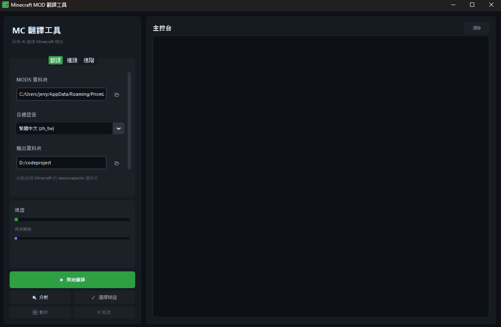

<div align="center">


# Minecraft MOD 翻譯工具

**使用本地 AI 模型或 Google Translate 翻譯 Minecraft 模組**

選擇 mods 資料夾，自動輸出可直接載入遊戲的資源包。

[下載最新版本](https://github.com/Hsiung-Shao/minecraftTranslate/releases/latest) · [功能特色](#-功能特色) · [快速開始](#-快速開始) · [LM Studio 教學](#-lm-studio-完整設定教學)

---



</div>

<br>

## ✨ 功能特色

<table>
<tr>
<td width="50%" valign="top">

### 🌐 多翻譯來源
- 本地 LLM（LM Studio / Ollama）
- Google Translate（免費、不需 API Key）
- OpenAI 相容自訂端點

### 📦 支援格式
- JAR `assets/*/lang/en_us.json`
- 遊戲目錄語言檔（config、kubejs 等）
- FTB Quests `en_us.snbt` 語言檔
- FTB Quests **嵌入任務文字**（chapter 檔中的 title/description）

</td>
<td width="50%" valign="top">

### 🧠 智慧翻譯
- 逐鍵比對：只翻譯新增或缺失字串
- 讀取既有 resourcepacks 避免重複
- SQLite 快取共享相同字串
- 合併模式：不覆蓋舊翻譯

### ⚡ 效能與自動化
- 並行批次處理
- Context 長度動態調整
- GPU VRAM 自動偵測建議
- 自動偵測 MC 版本 + pack_format
- 格式碼保護（§、%s、`<T1>`）+ 自動修復

</td>
</tr>
</table>

<br>

## 📋 系統需求

|  | 需求 |
|--|------|
| **作業系統** | Windows 10/11（macOS / Linux 可用原始碼執行） |
| **翻譯方式** | 二擇一：本地 LLM（建議 8GB+ VRAM）或 Google Translate（免費、無硬體需求） |
| **推薦模型** | Qwen3 8B / 14B（中文能力優秀） |

<br>

## 📥 安裝

### 🟢 方式 A — 下載 .exe（推薦一般使用者）

**不需要安裝 Python 或任何依賴，下載一個檔案雙擊就能用。**

1. 前往 **[Releases 頁面](https://github.com/Hsiung-Shao/minecraftTranslate/releases/latest)**
2. 下載 `MinecraftTranslate.exe`（約 24 MB）
3. 雙擊執行

> 💡 Windows 首次執行可能跳出 SmartScreen 警示（因 exe 未簽章），點「**其他資訊 → 仍要執行**」即可。

👉 跳到 [快速開始](#-快速開始)

---

### 🛠️ 方式 B — 從原始碼執行（開發者）

```bash
git clone https://github.com/Hsiung-Shao/minecraftTranslate.git
cd minecraftTranslate

# 建議使用虛擬環境
python -m venv .venv
.venv\Scripts\activate          # Windows
source .venv/bin/activate       # macOS/Linux

pip install -r requirements.txt
python main.py
```

只需兩個第三方套件：`customtkinter` + `requests`。

<br>

## 🚀 快速開始

> **方式 A**：雙擊 `MinecraftTranslate.exe`
> **方式 B**：執行 `python main.py`

### 使用流程

| 步驟 | 操作 | 說明 |
|:---:|------|------|
| **1** | 切到「**連線**」分頁 | 選擇服務商並測試連線 |
| **2** | 選擇服務商 | **LM Studio (本機)** / **Google Translate** / 自訂 |
| **3** | 點「🔌 測試連線」 | 確認模型已載入 |
| **4** | 切回「**翻譯**」分頁 | 設定翻譯任務 |
| **5** | 點 📂 選 mods 資料夾 | 輸出資料夾會自動填為同實例的 `resourcepacks/` |
| **6** | 選擇目標語言 | 預設繁體中文，支援 13 種 |
| **7**（選） | 「**進階**」→ 偵測 VRAM | 自動填入 context / batch / workers |
| **8** | 點 ▶ **開始翻譯** | 或先「🔍 分析」查看待翻譯模組 |
| **9** | 完成 | 資源包自動輸出，進遊戲啟用 |

### 其他操作

- **🔍 分析** — 先掃描看有哪些模組需要翻譯（不實際翻譯）
- **✓ 選擇模組** — 分析後挑選特定模組翻譯
- **⏸ 暫停 / ✕ 取消** — 翻譯進行中可暫停或終止

<br>

## 📊 實測效能參考

以下為實際測試的耗時數據，供時間預估參考。

### 測試硬體

```
CPU    Ryzen 7 9800X3D
GPU    RTX 5070 (12 GB VRAM)
RAM    64 GB
模型    Qwen3 8B (Q4_K_M), Enable Thinking 關閉
```

### 實測結果

| 整合包 | 模組數 | 字串數 | 耗時 |
|--------|:-----:|:-----:|:----:|
| Craft to Exile 2 (VR Support) | ~250 | ~33,000 | **≈ 1.5 小時** |
| All the Mons - ATMons | ~240 | ~40,000 | **≈ 1.5 小時** |

> ⚡ **速度關鍵**：關閉 **Enable Thinking** 是最重要的加速設定（可快 2-3 倍）。其次是 context 長度與 batch size — 設越大越能減少 API 呼叫次數。

<br>

## 🤖 LM Studio 完整設定教學

LM Studio 是免費的本地 LLM 執行工具，在自己電腦上跑大型語言模型，**不需要任何 API Key，資料完全不上傳**。

### 步驟 1：安裝 LM Studio

1. 下載：**[https://lmstudio.ai/](https://lmstudio.ai/)**（Windows / macOS / Linux）
2. 安裝後第一次開啟會引導你建立 models 資料夾

---

### 步驟 2：下載模型

開啟 LM Studio，點左側 🔍 **Discover**（放大鏡圖示）進入模型搜尋頁。搜尋框輸入 `Qwen3 8B`，右側會列出可下載的版本。

<div align="center">

</div>

#### 推薦模型

**≤ 8 GB VRAM（入門）**

| 模型 | 量化 | 大小 | 說明 |
|------|:----:|:----:|------|
| Qwen3 4B | Q5_K_M | ≈ 3 GB | 輕量，速度最快 |
| Qwen3 8B | Q4_K_M | ≈ 5 GB | 平衡點 |
| Llama 3.1 8B Instruct | Q4_K_M | ≈ 5 GB | 通用，中文稍弱於 Qwen |
| GLM-4 9B Chat | Q4_K_M | ≈ 5.5 GB | 中文表現佳 |

**12 GB VRAM（甜蜜點：RTX 5070 / 4070 Ti / 3060 12G）**

| 模型 | 量化 | 大小 | 說明 |
|------|:----:|:----:|------|
| Qwen3 8B | Q6_K / Q8_0 | 6.6 / 8.5 GB | 跑高量化版，品質最好 |
| **Qwen3 14B** | **Q4_K_M** | **≈ 8.5 GB** | **⭐ 推薦首選** |
| Qwen3 14B | Q5_K_M | ≈ 10 GB | 品質再上一層 |
| Gemma 2 9B | Q5_K_M | ≈ 6.5 GB | Google，多語言強 |
| Mistral Nemo 12B | Q4_K_M | ≈ 7 GB | context 128K |
| GLM-4 9B Chat | Q6_K | ≈ 8 GB | 中文流暢度高 |

#### 下載步驟

1. 列表選擇模型（**不要**選 VL / Coder 版本）
2. 右側確認 Format 為 `GGUF`
3. **Download Options** 選擇量化等級
4. 看到 🟢 **Full GPU Offload Possible** 代表 VRAM 足夠
5. 點 **Download**（視網速需數分鐘）

> 💡 **量化選擇原則**：Q4_K_M 是速度/品質甜蜜點；Q5_K_M 品質更好但慢一些；Q3 以下明顯下降。同 VRAM 下 **大模型低量化 > 小模型高量化**（14B Q4 > 8B Q6）。

---

### 步驟 3：開啟開發者伺服器

點左側 **Developer**（`</>` 圖示）進入開發者模式。

<div align="center">

</div>

1. 上方「**Status**」開關切到 **Running**（綠色）
2. 右上角 **Reachable at** 顯示伺服器位址
3. 埠號預設 `1234`

---

### 步驟 4：載入模型

點右上角 **+ Load Model** 開啟對話框：

<div align="center">

</div>

選擇要用的模型並點擊載入。載入過程的 log：

<div align="center">

</div>

觀察重點：
- `load_tensors: CUDA0` — 模型成功載入 GPU
- 結尾顯示 `loaded in X.XX seconds` 代表完成

---

### 步驟 5：調整模型參數

載入完成後右側出現參數面板：

<div align="center">

</div>

#### 建議設定

| 參數 | 建議值 | 說明 |
|------|--------|------|
| **Context Length** | ≥ 8192 | 大 VRAM 可設 16384 / 32768 |
| **Enable Thinking** | **關閉 ⚡** | 開啟會慢 2-3 倍，翻譯品質無差別 |
| **System Prompt** | 留空 | 翻譯工具會自行傳入 |

**保持 LM Studio 視窗開啟**，繼續下一步。

---

### 步驟 6：在翻譯工具中連線

1. 啟動工具（執行 `python main.py` 或雙擊 `.exe`）
2. 切到「**連線**」分頁
3. 服務商選 **LM Studio (本機)**
4. URL 確認 `http://localhost:1234/v1`
5. 點 **🔌 測試連線**，應看到：
   ```
   ● 已連線 (N 個模型)
   連線成功！可用模型: qwen3-8b
   當前已載入模型: qwen3-8b
   ```

---

### 🌐 跨電腦使用（選擇性）

若 LM Studio 在區網另一台電腦：

1. LM Studio Developer → Settings → 勾選 **Serve on Local Network**
2. 記下伺服器 IP（例 `192.168.1.100`）
3. 翻譯工具 URL 改為 `http://192.168.1.100:1234/v1`

---

### ⚠️ LM Studio 常見問題

<details>
<summary><b>模型載不起來</b></summary>

VRAM 不足，換更小的模型或更高量化等級（Q3、Q4）。
</details>

<details>
<summary><b>回應非常慢</b></summary>

- 確認 **GPU Offload** 拉到最高
- 確認 **Enable Thinking** 已關閉
- 若 CPU 跑模型會非常慢，檢查 GPU 驅動是否正常
</details>

<details>
<summary><b>批次翻譯超時</b></summary>

把 GUI 的 Context 長度改小，或批次大小調到 10。
</details>

<details>
<summary><b>模型會亂輸出思考過程</b></summary>

關閉 **Enable Thinking**，或改用非 thinking 版本的模型。
</details>

<br>

## ⚙️ 進階設定

### 批次大小與 Context

- **Context 長度** 越大，每批可塞更多字串
- 預設 **8192 tokens**
- 大 context 模型（如 Qwen3 32K+）可手動調到 16384 或 32768

### VRAM 建議表

| VRAM | context | batch_size | workers |
|:----:|:-------:|:----------:|:-------:|
| < 6 GB | 4096 | 8 | 1 |
| 6-12 GB | 8192 | 15 | 2 |
| 12-24 GB | 16384 | 20 | 2 |
| > 24 GB | 32768 | 30 | 3 |

點 GUI 的「**進階 → 偵測 VRAM 自動設定**」可自動套用。

<br>

## 📁 翻譯目錄結構

工具會掃描遊戲目錄下的以下路徑：

```
<minecraft/>
├── mods/                         # JAR 模組
│   └── *.jar
├── config/
│   ├── flan/lang/en_us.json      # 一般設定中的語言檔
│   └── ftbquests/quests/
│       ├── chapters/*.snbt       # FTB Quests 嵌入式文字 ⭐
│       └── lang/en_us.snbt       # FTB Quests 匯出的語言檔
├── kubejs/
│   └── assets/*/lang/en_us.json
├── patchouli_books/
│   └── */en_us/...
└── resourcepacks/                # 既有翻譯會被讀取避免重複
    └── *.zip
```

<br>

## 📤 輸出

### 資源包 `.zip`

大部分翻譯打包成 Minecraft 資源包：

```
ModTranslation_zh_tw.zip
├── pack.mcmeta                   # pack_format 自動偵測
└── assets/
    ├── minecraft/lang/zh_tw.json
    ├── create/lang/zh_tw.json
    └── .../lang/zh_tw.json
```

### SNBT / FTB Quests

- `en_us.snbt` → 產生 `zh_tw.snbt` 放在同目錄
- FTB Quests 任務檔 → **直接修改原 SNBT 檔案**（建議先備份）

### 快取與記錄

- `translation_cache.db` — SQLite 翻譯快取，刪除可重新開始
- `logs/translation_YYYYMMDD_*.log` — 完整記錄
- `logs/issues_YYYYMMDD_*.log` — 只含警告與錯誤

<br>

## 🗂️ 專案結構

```
minecraftTranslate/
├── main.py
├── requirements.txt
├── MinecraftTranslate.spec       # PyInstaller 打包設定
├── src/
│   ├── core/                     # 設定、事件匯流排、資料模型
│   ├── extractor/                # JAR / 資料夾 / SNBT / FTB Quests 掃描器
│   ├── translator/               # 翻譯引擎、格式保護、批次處理
│   ├── cache/                    # SQLite 翻譯快取
│   ├── packager/                 # 資源包 zip 建立（合併模式）
│   ├── pipeline/                 # 翻譯管線、進度追蹤
│   ├── hardware/                 # VRAM 偵測
│   └── gui/                      # CustomTkinter 介面
├── data/
│   ├── languages.json            # 支援語言定義
│   └── dictionary.json           # 使用者術語覆蓋
├── assets/                       # 圖示資源
├── scripts/                      # 輔助腳本（生成 icon 等）
└── image/                        # README 截圖
```

<br>

## ❓ 常見問題

<details>
<summary><b>Q：已翻譯過的模組會重新翻譯嗎？</b></summary>

不會。工具會比對 resourcepacks 中既有翻譯，**逐鍵檢查**，只翻譯缺失的部分。
</details>

<details>
<summary><b>Q：FTB Quests 任務檔會被修改嗎？</b></summary>

是的，會**直接修改** `config/ftbquests/quests/chapters/*.snbt` 原檔。建議先備份。
</details>

<details>
<summary><b>Q：翻譯中斷後可以繼續嗎？</b></summary>

可以。關掉重開再按「開始翻譯」，已翻譯的部分會從快取自動跳過。
</details>

<details>
<summary><b>Q：Google Translate 有限制嗎？</b></summary>

有。免費公開端點有速率限制（工具已加入 50ms 延遲），若被暫時封鎖請休息數分鐘再試。
</details>

<details>
<summary><b>Q：怎麼把翻譯分享給其他人？</b></summary>

把產生的 `ModTranslation_zh_tw.zip` 直接傳給他人，放到他們的 `resourcepacks/` 即可。
</details>

<details>
<summary><b>Q：遊戲版本變了怎麼辦？</b></summary>

工具自動偵測版本並套用正確 `pack_format`，不用擔心。
</details>

<br>

## 📜 授權

自由使用。

<div align="center">

**Made with ❤️ for the Minecraft modding community**

[⬆ 回到頂部](#minecraft-mod-翻譯工具)

</div>
